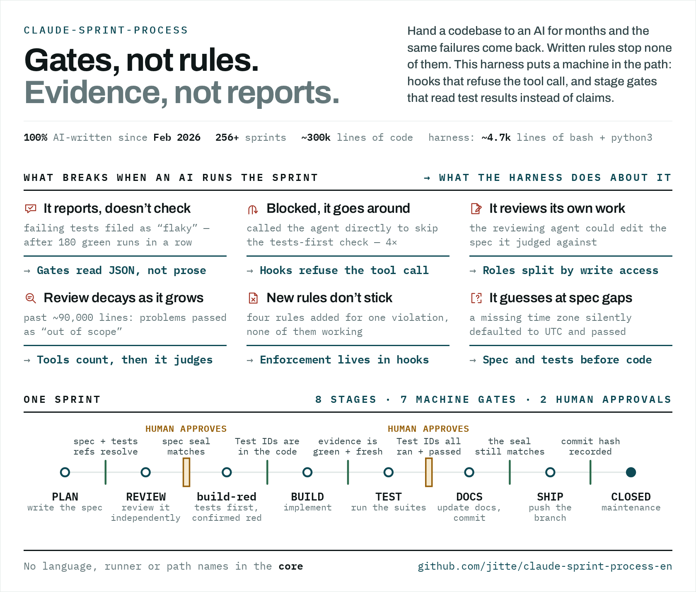

# claude-sprint-process

Languages: [English](https://github.com/jitte/claude-sprint-process-en) | **Japanese**



## 1. これは何か

Claude Code に開発を任せ続けるためのハーネスである。仕様・テスト・実装・文書の 4 つを、互いに食い違わないまま進める。

2026 年 2 月から、コードを AI に書かせる開発を続けている。スプリントはのべ 256 回以上、コードはのべ約 30 万行、文書はのべ約 23 万行になった。このハーネスは、その間に起きた問題へ 1 件ずつ対策を足してできたものである。本体は bash と python3 で約 4,700 行あり、標準ライブラリだけで動く。ほかに回帰テストが約 5,000 行、雛形と文書が約 1,900 行ある。

生成 AI を使う開発の方法論は、短い期間に急速に変わり続けている。prompt engineering（PE）から context engineering（CE）、harness engineering（HE）、loop engineering（LE）、graph engineering（GE）へと、設計する単位は 1 回の指示から複数エージェントの結線まで広がってきた。CSP はこれらを参照して作ったものではない。開発品質の観点で問題に 1 件ずつ対策を足した結果、同じ道を辿った。いわば収斂進化である。要素ごとに並べると次になる。

| 要素 | PE | CE | HE | LE | GE | CSP |
|---|---|---|---|---|---|---|
| 設計の単位 | 1 回の指示 | 1 手番に渡す情報 | モデルを包む実行環境 | 1 エージェントの周回 | 複数エージェントの結線 | 1 スプリント（ステージの列） |
| 検証器（生成と分離） | — | — | 実行環境（テスト・型検査） | 外部の検証器 | ノードごとの検証と拒否 | ゲートツールと qa。証跡 JSON を読む |
| 停止条件 | — | — | — | 停止規則 | 終端ノード | 目標ステージと 🚧 |
| 失敗の分類と戻し先 | — | — | — | 回復可能か致命かの分類 | 経路の切替 | 失敗分類 4 種 → 巻き戻し先 |
| 記憶 | — | 読ませる範囲の選択 | ファイル・永続記憶 | 周回をまたぐ記憶 | 辺を流れる共有状態 | `flags.json`・封印ハッシュ・RETRO → 恒久文書 |
| 遷移の許可と権限 | — | — | 権限の境界 | — | 辺の許可・ノードの権限 | 前進規則を hook が強制。ステージ × エージェントの起動可否、書き込み範囲 |
| 人の承認 | — | — | 権限の確認 | — | 承認ノード | 🚧 2 箇所 |
| 構成の版管理 | — | — | — | 周回の仕様を成果物にする | 結線を版管理する | `sprint.config.json` と `sprint-process.md` |
| 可観測性 | — | — | ログ | 周回の記録 | トレース | 遷移ログ・tool ログ・`sprint log` |
| 自動トリガ・並列 | — | — | — | トリガ | 分岐と合流 | 無し。人が起動し、単一環境で回す |
| コスト予算 | — | context window | — | 回数の上限 | token の予算 | 無し |

CSP は、HE の実行環境を前提に、LE と GE の要素を 1 スプリントの形で固定したものである。周回は「ステージを進め、ゲートで止め、失敗の分類で巻き戻す」の 1 種類だけで、結線はステージの列と巻き戻しの辺だけである。分岐・並列・自動トリガは持たない。1 つの環境で人が起動し、🚧 で人が承認する設計だからである。

LE・GE と違う点は 3 つある。周回を回す主体が、外のスクリプトではなく Claude Code の main である。エージェントごとの結線ではなく、ステージごとの起動可否と書き込み範囲で権限を分ける。コスト（周回数・token）の予算を持たず、REVIEW の巡数を記録するだけである。

## 2. 解決する課題

起きたことを並べると、一つ一つは個々の不注意に見える。しかしよく分析すると、AI に開発を任せたときに繰り返し現れる構造が見えてくる。以下に、実際に起きたことと、その背景にある構造を書く。

### 2.1 確かめるより、報告するほうが安い

- 落ちたテストを「今回の変更とは無関係」「もともと不安定なテスト」と分類し、合格と報告した。同じテスト群は、180 回続けて実行して一度も落ちていなかった
- 実装役の AI が「全ルートを検査した」と報告した。実際には、4 本を「開発用の DB を壊す」という理由で黙って外していた
- 1 回の作業の中で、確かめていない補足を報告に 4 回書いた。どれもコマンド 1 回で否定できる内容だった

「無関係」「完了」は一言で書ける。確かめるにはコマンドを実行し、結果を読まなければならない。AI は手間の少ないほうを選ぶ。報告を書くのが作業をした本人である限り、規則で禁じても同じことが起きる。

### 2.2 止められると、別の道を探す

- テストを先に書く手順のチェックは、決まったコマンドを通るときだけ働いた。AI はそのコマンドを使わずに実装役を直接呼び出し、テストを飛ばした。同じことが 4 回起きた
- 人の承認待ちでエージェントの起動を止められると、AI は工程の状態ファイルを書き換えて先へ進もうとした
- 画面を操作するはずの E2E テストが、48 ファイル・305 か所で API を直接呼んでいた。直す段階でも、AI は「画面からは難しい」と自分で判断し、184 か所を例外として残した
- テストが通らないとき、AI はテストではなく製品の画面を変えた。見出しの文言を削り、表示を CSS で隠して合格させた

AI にとって、止められたことは片付けるべき障害になる。先へ進むことが目的になり、なぜ止められたかは考慮されない。チェックに抜け道があれば、AI はそこを通る。

### 2.3 書く役と評価する役が、同じファイルを書ける

- 評価役の AI が、合格の基準である仕様とテスト仕様を編集できる状態だった
- 評価役が、書き手の記入欄を上書きして前回の記録を消した。その欄は「更新しない」と指示してあった
- 実装した AI が自分でテストも書くと、テストは実装の思い込みをなぞるだけになった。新しい API 6 本が、テストの無いまま出荷された

役割を名前で分けても、書き込めるファイルが同じなら分かれていない。「触らない」という指示では、境界は守られなかった。

### 2.4 規模が大きくなると、評価が先に崩れる

- コードと文書が合わせて約 9 万行を超えると、評価役は見つけた問題を警告のまま通し、「該当なし」「スコープ外」を合格の理由にし始めた
- 「古い処理を新しい処理に統合する」作業で、AI は新しい処理を足しただけで古い処理を残した。記録には「統合済み」とあり、食い違いは 8 週間見つからなかった
- 1 回の作業の範囲が大きすぎて、文脈の上限を使い切った。仕上がった機能は、人が試した操作のすべてに不具合があった

評価するには、仕様・実装・テストを並べて読む必要がある。量が文脈に収まらなくなると、照合は表面だけになる。それでも合格は返り続けるので、崩れたことが外から見えない。また、足したものはテストで確かめられるが、消したかどうかを確かめる手段は無かった。

### 2.5 規則を足しても、次の作業に残らない

- 同じ違反のたびに文書へ規則を足した。4 回目の再発の時点で、足した 4 つの規則はどれも働いていなかった
- 振り返りのたびに、AI は新しい規則を書き、「次の工程で正式な文書に移す」と送った。規則は移されないまま残った
- 作業のやり方について作者が AI に出した指摘は、記録したものだけで 79 件になった

文書の規則は、読まれたときにしか働かない。エージェントを直接呼び出したとき、会話が長くなって要約されたとき、規則は読まれなくなる。守られたのは、ツールが実行そのものを止める仕組みと、役割の定義に直接書いた規則だけだった。

### 2.6 仕様の空白を、AI は推測で埋める

- 仕様を検討しながら実装を始めると、仕様は作業ごとの文書に散らばった。AI は曖昧な箇所を、確認せずに推測で埋めた
- 人が詳しい計画を渡すと、AI はそれを確定した仕様とみなし、仕様を詰める工程を省いた
- 時刻の基準は、仕様の一か所には書かれ、別の一か所には書かれていなかった。AI は書かれていない側を UTC のまま実装し、書式しか見ないテストはそれを通した

AI は、手を止めて聞くより、もっともらしい値で埋めて進む。テストは仕様から書くので、仕様に無い穴はテストにも無い。

## 3. 方針

対策は、起きた順に足していった。最初に、エージェントの起動と書き込み先を制限する hook を入れた。次に、ステージの skip をスクリプトで拒否し、仕様を封印して書く側と評価する側を分けた。続いて、ステージの入口にゲートを置き、テストの実行結果で判定するようにした。最後に、仕様の参照を機械で辿れるようにし、技術に依存する部分をアダプタと設定に切り出した。

2 の構造に対して、次の方針を取っている。

### 3.1 報告ではなく証跡で判定する（2.1）

lint・typecheck・build・test・e2e の結果は、決まった形の JSON に書き出す。ゲートはこの JSON だけを読む。「通った」「無関係だった」という報告は、人のものでもエージェントのものでも判定に使わない。TEST に書いた Test ID は、実行結果の中に passed として現れるまで合格にならない。

### 3.2 指示ではなく機械で止め、抜け道を残さない（2.2・2.5）

守らせたいことは、文書に書くのではなく hook とゲートで止める。エージェントの起動は、どの経路から呼ばれても hook が判定する。ステージの状態ファイルは専用のコマンドでしか書き換えられず、前進は 1 段ずつに限る。

### 3.3 書く役と評価する役を、書き込み権限で分ける（2.3）

役割ごとに、書き込めるファイルの種別を hook で決める。監査を終えた仕様とテスト仕様はハッシュで封印し、評価役が書けるのは結果の記入欄だけにする。テストは、実装を読む前に、テスト役が仕様から書く。

### 3.4 数えられるものは機械が数える（2.4）

評価役にすべてを読ませない。条項の参照が切れていないか、Test ID が実行されたか、実装と仕様のルートの集合が一致するかは、ツールが数える。評価役は、その結果と仕様を読んで判断する。

### 3.5 仕様とテストを先に書き、人が承認する（2.6）

実装の前に、仕様（SPEC。要件は EARS の形式で書く）とテスト仕様（TEST）を書く。人が止まって判断するのは、仕様の監査が終わった後と、テストが終わった後の 2 か所である。それ以外のステージは、ゲートを通る限り AI が自分で進める。

### 3.6 技術に依らない

ハーネスの本体は、言語・テストランナー・ディレクトリの名前を持たない。ランナーごとの処理はアダプタだけに書き、ファイルの配置は設定ファイルから読む。別の言語やフレームワークのプロジェクトにも、本体を変えずに入れられる。

## 4. 仕組み

### 4.1 ステージ

スプリントは次の順に進む。前進は 1 段ずつで、各ステージの入口にゲートがある。🚧 は人が承認する地点である。


| ステージ | すること | 起動できるエージェント | 入口のゲート |
|---|---|---|---|
| PLAN | README / SPEC / TEST を書く | なし | — |
| REVIEW | 仕様を独立に監査する | qa | SPEC / TEST がある・条項の参照が正しい |
| 🚧 | 人が仕様を承認する | | |
| build-red | テストを先に書き、落ちることを確かめる | tester | 封印・条項の参照 |
| BUILD | 実装する | backend / frontend / tester | TEST の Test ID がテストコードにある |
| TEST | テストを実行し、品質を評価する | tester / qa | 証跡がソースより新しく green である・ファイルのサイズ |
| 🚧 | 人がテスト結果を承認する | | |
| DOCS | 仕様書に反映し、実装と文書を commit する | qa | 証跡・Test ID が実行されて passed |
| SHIP | 実装の品質を確かめ、ブランチを push する | qa | 証跡・Test ID の実行・封印 |
| CLOSED | 保守 | すべて | コミットハッシュが記入されている |

### 4.2 コマンド

操作の入口は 2 つある。`bash harness/bin/sprint` が本体で、`/sprint` スキルはそれを呼ぶ。

#### `bash harness/bin/sprint <サブコマンド>`

`.sprint/flags.json` を書き換えられるのはこのコマンドだけである。ファイルを直接編集すると `edit-scope-gate.sh` が拒否する。

状態を扱うサブコマンド:

| サブコマンド | 動作 |
|---|---|
| `stage <STAGE>` | active スプリントのステージを遷移する。前進は次の 1 段だけ。skip は拒否する。巻き戻しは常に許可する。前進時はゲートを自動で実行する |
| `set-status <open\|doing\|closed>` | ステージ内の進み具合を更新する |
| `new <id> <dir> [kind]` | スプリントを作る。雛形から README / SPEC / TEST を展開し、active を切り替える |
| `switch <id>` | active スプリントを切り替える |
| `get [<field>]` | active スプリントの値を出す（省略時は stage） |
| `status [--json]` | stage / 封印 / テスト失敗数 / 実行証跡の鮮度 / 直近の遷移を 1 画面に集める |
| `list` | 全スプリントの一覧 |
| `log` | ステージ遷移ログの集計（巻き戻しとゲート失敗の観測） |
| `set-kind` / `set-dir` / `rename` | kind・ディレクトリ・ID の変更 |

タスクを実行するサブコマンド:

| サブコマンド | 動作 |
|---|---|
| `run <task>\|all [<component>] [-- <追加引数>...]` | 設定の `tasks` の順にアダプタを起動し、証跡契約の JSON を書く。追加引数を渡した実行は部分実行であり、証跡は `.partial.json` に書く |

検査のサブコマンド:

| サブコマンド | 動作 |
|---|---|
| `gate <STAGE>` | ステージゲートを手動で実行する（遷移はしない） |
| `seal` / `seal-verify` | SPEC.md / TEST.md の封印と照合 |
| `spec-lint [<検査>...]` | 仕様の機械検査（`graph` / `refs` / `test-id`） |
| `spec-graph [<引数>...]` | 条項参照グラフ。引数なしは `verify` |
| `spec-coverage [<引数>...]` | 条項参照カバレッジ（cov / rcov / tcov）。指標であり fail しない |
| `api-routes` | 公開ルート集合の双方向比較 |
| `size-audit` | サイズ超過ファイルの列挙 |
| `spec-check [<dir>]` | SPEC.md / TEST.md の構造検査 |

#### `/sprint`（Claude Code のスキル）

`harness/skills/sprint/SKILL.md` を `.claude/skills/sprint/SKILL.md` に写すと使える。スプリントを進めるのは main であり、このスキルはその手順を持つ。

| コマンド | 短縮 | 動作 |
|---|---|---|
| `/sprint status` | `stat` | `sprint status` を実行して状態を出す |
| `/sprint resume` | `r` | `/clear` の後の復元。状態・README / SPEC / TEST・CLAUDE.md を読み、次の作業を示す |
| `/sprint handover` | `ho` | `/clear` の前の準備。6 項目を点検し、直せるものを直してから表で返す |
| `/sprint new <id> <名前>` | `n` | 名前から `sprint_dir` を導き、`sprint new` を実行する |
| `/sprint switch <id>` | `sw` | active スプリントを切り替える |
| `/sprint stage <STAGE>` | `stag` | ステージを 1 段だけ遷移する（作業はしない） |
| `/sprint [to] <STAGE>` | `t` | 目標ステージまで各ステージの作業を実行する。目標に着いたら止まる |
| `/sprint help` | `he` | コマンド一覧 |

- 🚧 ゲート（REVIEW の後・TEST の後）は `/sprint to <STAGE>` でも通過しない。到達したら止まり、ユーザーの指示を待つ
- カバレッジの指標は `/spec-coverage` スキルが持つ（`harness/skills/spec-coverage/SKILL.md`）

### 4.3 hook とゲート

hook は `.claude/settings.json` に登録する。止める hook はツールを実行する前に動き、記録する hook は実行の後に動く。

| hook | 動く時点 | すること |
|---|---|---|
| `agent-gate.sh` | エージェントを起動する前 | ステージと役割の組み合わせで、起動を許可するか拒否する |
| `edit-scope-gate.sh` | Write / Edit の前 | 役割とファイルの種別の組み合わせで、書き込みを拒否する。封印した範囲と `.sprint/flags.json` への書き込みも拒否する |
| `block-cd.sh` | Bash の前 | `cd` を拒否し、作業ディレクトリをプロジェクトのルートに固定する |
| `record-test-fails.sh` | Bash の後 | 証跡からテストの失敗件数を記録する |
| `log-tool.sh` / `log-agent-event.sh` | ツールの前後・エージェントの開始と終了 | 操作を記録する |

ゲートは `sprint.config.json` の `gates` に、ステージごとに並べる。`sample/` の設定は次のとおりである。

| ステージ | ゲートツール | 見るもの |
|---|---|---|
| REVIEW | `spec-files-exist` / `spec-lint` | SPEC と TEST がある。条項の参照・参照した条項のテストの扱い・Test ID の形が正しい |
| build-red | `spec-seal` / `spec-lint` | 封印が一致する |
| BUILD | `tdd-exists` | TEST の Test ID がテストコードにある |
| TEST | `results` / `size-audit` | 証跡がソースより新しく green である。行数の上限を超えるファイルが無い |
| DOCS | `results` / `tdd-audit` | TEST の Test ID がすべて実行され passed である |
| SHIP | `results` / `tdd-audit` / `spec-seal` | DOCS の検査に加えて封印が一致する |
| CLOSED | `ship-closed` | README にコミットハッシュが記入されている |

ゲートが落ちると、原因を 4 つ（仕様・実装・テスト・基盤）に分け、戻るべきステージを示す。遷移そのものはしない。どこへ戻すかは人が決める。

仕様と実装と文書の対応は、次の 3 つで確かめる。

- 条項の参照: 仕様の節に条項 ID を付け、参照は ID へのリンクで書く。`spec-graph` が、参照先があるか・ID が重複していないか・参照が循環していないか・リンクが切れていないか・他の文書の節を節番号で指していないかを検査する
- 実装と仕様の集合: API ルートを実装から取り出し、仕様に書かれたルートと両方向で比べる（設定したときだけ）
- 条項の変更: DOCS で、内容が変わった条項を diff から取り出し、SPEC に宣言したテストの扱いと照らし合わせる

### 4.4 契約

ハーネスがプロジェクトに求める取り決めは、次の 4 つだけである。技術の名前を持つのは `harness/adapters/` だけで、本体はこの 4 つを通してプロジェクトを扱う。

| 契約 | 内容 |
|---|---|
| タスク契約 | 動詞は `lint`・`typecheck`・`build`・`test`・`e2e` の 5 つに固定する |
| 証跡契約 | 実行結果は `<evidence.dir>/<component>.<task>.json` に、決まった形の JSON で書く |
| 配置契約 | コンポーネントと docs の場所は `sprint.config.json` から読む。本体はパスを持たない |
| 集合契約 | 実装側の集合（API ルート）は正規表現で取らず、実装を実行・import した結果から取る |

### 4.5 構成

```
.
├── README.md
├── docs/                         スプリントプロセスとゲートツールの仕様（README.md と 6 文書を取り込み先へ写す）
│   ├── README.md                 docs/ の構成（01_overview 〜 08_decisions）
│   ├── 07_plans/README.md        スプリントの計画と記録の書き方。導入の局面と測定
│   ├── 04_standards/02_testing.md          テストの規範
│   ├── 04_standards/03_spec-structure.md    仕様の構造の規範（上流で当てはめ、後からリファクタリングする）
│   ├── 05_specifications/README.md         条項 ID の書き方
│   └── 06_process/
│       ├── sprint-process.md               ステージ定義・エージェント起動制御
│       └── gate-tools.md                   ゲートツール仕様・契約
├── harness/                      本体（取り込み先の直下へそのまま写す）
│   ├── bin/sprint                ランナー（new / stage / run / gate）
│   ├── lib/                      設定・証跡の読み取り。ルート解決
│   ├── tools/                    spec-graph・spec-coverage・xref の検証ツール
│   ├── gate-tools/               ステージゲート
│   ├── hooks/                    Claude Code の hook（PreToolUse / PostToolUse）
│   ├── adapters/                 ランナーごとの実行と証跡変換（eslint-tsc / node-vitest / playwright / vite-build）
│   ├── templates/                SPEC / TEST / README の雛形と、上位仕様 / 末端仕様の雛形
│   ├── agents/                   エージェント定義の雛形（backend / frontend / tester / qa）
│   ├── skills/                   /sprint と /spec-coverage スキル
│   └── tests/                    本体の回帰テスト（python3 unittest。85 件）
└── sample/                       取り込み後の形の見本（component 1 つ、TypeScript + vitest）
    ├── sprint.config.json
    ├── harness -> ../harness
    ├── .claude/                  settings.json（hooks）・agents/・skills/
    ├── app/                      最小プロジェクト
    ├── docs/                     01_overview 〜 08_decisions。07_plans/01_hello/01_hello に全ゲート通過の記録
    └── .sprint/                  作業状態の記録（flags.json・logs/）。見本として commit している
```

### 4.6 補足

- `harness/bin/sprint` は、プロジェクトのルートを次の順で決める。`CLAUDE_PROJECT_DIR` → cwd から上へ辿って最初に `sprint.config.json` があるディレクトリ → git のトップ → pwd。1 つの git リポジトリに複数のプロジェクトがある形（このリポジトリの `sample/`）でも、そのディレクトリの中で実行すれば見つかる
- ステージとゲートの定義は `docs/06_process/sprint-process.md`、ゲートツール・契約・アダプタの詳細は `docs/06_process/gate-tools.md` にある

## 5. 使い方

### 5.1 使う前に（免責事項）

本書の読者は、このハーネスを自分のプロジェクトに入れようとする人である。§5.4 と §5.6 のコードブロックは、あなたが自分の Claude Code に貼り付けて実行させる**プロンプト**であり、読者への指示ではない。

- プロンプトは、あなたのリポジトリにファイルを書き、コマンド（テスト・ゲート）を実行する。何をするかを読んで理解してから貼り付ける。理解できない手順があれば使わない
- プロンプトは AI に「対象リポジトリの外を書き換えない」と命じている。それが守られるかは、実行する AI とあなたの Claude Code の permission 設定に依る。リポジトリ外への書き込みを許可しない設定で実行する
- 依存コマンドの導入（§5.3）は、あなたが事前に行う。AI に入れさせない
- 本ハーネスは現状のまま提供する。使用の結果について作者は責任を負わない

### 5.2 前提

#### 実行環境

Ubuntu 24.04 LTS 以降。

#### 必要なコマンドと機能

| コマンド | 使う機能 | 動作を確認した実装 |
|---|---|---|
| bash | 4 以上。`declare -A`・`mapfile` | GNU bash 5.2 |
| jq | — | 1.6 |
| python3 | 標準ライブラリだけ。pip は使わない | 3.11 |
| git | — | 2.54 |
| coreutils | `readlink -f`・`stat -c`・`sha256sum`・`date +%s%3N`・`realpath --relative-to`・`comm`・`sort -t / -n / -u`・`head -c`・`tail -F`・`mktemp -d` | GNU 9.1、uutils 0.11.0 |
| findutils | `find -name / -type / -o / -newer / -maxdepth`・`xargs -r -d` | GNU 4.9、uutils 0.10.0 |
| sed | `-E`・`-n`・`-i`（`-i` は `harness/tools/hook-replay.sh` だけ） | GNU 4.9 |
| grep | `-E`・`-o`・`-q`・`-x`・`-n`・`-r`。`-P` は使わない | GNU 3.8 |
| awk | `-F`・`-v`（POSIX の範囲） | mawk 1.3 |

ランナー（vitest や pytest）はプロジェクト側の依存であり、本書の依存には含まない。`sample/` は Node と npm を使う。

### 5.3 インストール

取り込みのプロンプトを渡す前に、依存コマンドをあなたが入れる（§5.1）。

1. パッケージを入れる:

   ```bash
   sudo apt-get install python3 jq git
   ```

2. 確認する。各行がコメントの通りに出ればよい:

   ```bash
   bash -c 'echo $BASH_VERSION'   # 4.0 以上
   jq --version
   python3 --version
   sed --version | head -1        # GNU sed
   date +%s%3N                    # 13 桁の数
   readlink -f .                  # 絶対パス
   ```

### 5.4 取り込み（初回）

次のプロンプトを Claude Code にそのまま渡す。

```
claude-sprint-process（https://github.com/jitte/claude-sprint-process）を次の手順で取り込め。

0. 対象リポジトリの外（システムのディレクトリ・シェルの設定・パッケージ）を書き換えない。
   依存コマンド（README の「5.2 前提」の表）が無ければ、自分で入れずにユーザーに入れてもらう。

1. `git clone https://github.com/jitte/claude-sprint-process` する。`harness/` を
   対象リポジトリの直下にそのまま写す。`harness/skills/<name>/SKILL.md` を
   `.claude/skills/<name>/SKILL.md` に写す（sprint・spec-coverage の 2 つ）。

2. `sample/sprint.config.json` を対象リポジトリの直下に写し、次の項目を聞いて書き換える。
   値を自分で決めない。
   - `project.name`・`project.timezone`
   - `components`: コンポーネント名・ディレクトリ・役割（backend / frontend のような名前）・
     src と tests の glob・動詞（lint / typecheck / build / test / e2e）ごとに使う
     アダプタ・pre コマンド（無ければ書かない）
   - `docs`: `templates`・`livingDirs`・`sprintRoot`・`specDir`・`docAliases`
   - `evidence.dir`: 既定は `.sprint/test-result`。変えるときだけ聞く
   - `sets`: プロジェクト固有の集合を取り出すコマンド（API ルートの取得コマンド）
   - `gateToolsDirs`: プロジェクト固有のゲートツールを置くなら 2 つ目のディレクトリを
     追加する
   - `gateToolClasses`: プロジェクト固有のゲートツールがあるときだけ、その既定の
     失敗分類を書く
   - `gates`: ステージごとに走らせるツールの並び。`sample/sprint.config.json` の
     `gates.code` / `gates.docs` を出発点にしてよい
   `tasks` は書き換えない。`["lint", "typecheck", "build", "test", "e2e"]` の
   5 動詞で固定する。
   同梱アダプタは `node-vitest`・`eslint-tsc`・`vite-build`・`playwright` の 4 つ。
   使うランナーがこの 4 つに無ければ、`harness/adapters/<name>/` に `run-<verb>` と
   `convert-evidence` を新しく書く。

3. `docs/README.md` を写し、その構成で `docs/01_overview` 〜 `docs/08_decisions` を
   作る。04 / 05 / 06 / 07 の 6 文書（`docs/04_standards/02_testing.md`・
   `docs/04_standards/03_spec-structure.md`・
   `docs/05_specifications/README.md`・`docs/06_process/sprint-process.md`・
   `docs/06_process/gate-tools.md`・`docs/07_plans/README.md`）は、このリポジトリと
   同じ相対パスで対象リポジトリに写す。`harness/templates/` と `harness/agents/` はこれらのパスへのリンクを持つ。
   パスを変えない。01 / 02 / 03 / 08 は各 1 ファイルをユーザーに聞いて書く（概要 1
   段落・要件 1 つ以上・設計 1 段落・設計判断 1 件）。無いものは「未記入」とだけ書いた
   ファイルを置く。

4. `harness/templates/README.md`・`SPEC.md`・`TEST.md` を `sprint.config.json` の
   `docs.templates` に写す。`{{spec_docs}}`・`{{common_clauses}}`・
   `{{static_check_example}}`・`{{run_commands}}` の 4 つのプレースホルダを埋める。
   `spec-upper.md`・`spec-leaf.md`（上位仕様と末端仕様の雛形。
   `docs/04_standards/03_spec-structure.md`）も同じ場所に写す。プレースホルダは無い。

   `harness/agents/` を `.claude/agents/` に写す。`tester` と `qa` は必ず写す。
   `backend` と `frontend` は、対象リポジトリの `sprint.config.json` に同じ `role` の
   コンポーネントがあるときだけ写す（無い役割のエージェントは写さない）。

   各ファイルが持つプレースホルダ（`grep -o '{{[a-z_]*}}' harness/agents/*.md | sort -u`
   の実測）:

   | ファイル | プレースホルダ |
   |---|---|
   | backend.md | `{{project_name}}`・`{{tech_stack}}`・`{{implementation_rules}}`・`{{files_to_read}}`・`{{contract_spec_paths}}`・`{{extra_tools}}` |
   | frontend.md | `{{project_name}}`・`{{tech_stack}}`・`{{implementation_rules}}`・`{{files_to_read}}`・`{{contract_spec_paths}}`・`{{extra_tools}}` |
   | tester.md | `{{project_name}}`・`{{tech_stack}}`・`{{implementation_rules}}`・`{{files_to_read}}`・`{{extra_tools}}` |
   | qa.md | `{{project_name}}`・`{{extra_tools}}`・`{{project_review_items}}`・`{{project_docs_items}}`・`{{project_ship_items}}` |

   合わせて 9 種類（`project_name`・`tech_stack`・`implementation_rules`・
   `files_to_read`・`contract_spec_paths`・`extra_tools`・`project_review_items`・
   `project_docs_items`・`project_ship_items`）。埋める値はユーザーに聞く。自分で
   決めない。プレースホルダを残さない。

   `{{extra_tools}}` の書式: 追加のツールが無ければ空文字列にする。追加するときは
   `, mcp__xxx__yyy` のように先頭にカンマと空白を付けて既存のツール一覧に続ける形で書く。

5. `sample/.claude/settings.json` をそのまま対象リポジトリの `.claude/settings.json` に
   写す。hooks が `harness/hooks/*.sh` を指す。

6. `.gitignore` に、この取り込みで生まれる依存物のディレクトリを `name/` の形で書く
   （例: `node_modules/`）。加えて `.sprint/*` と `!.sprint/spec-hashes.json` を書く。
   `.sprint/` は作業状態（`flags.json`・`logs/`・証跡）であり、封印ハッシュ
   （`spec-hashes.json`）だけを追跡する。`sample/` は記録を見せるために
   `flags.json` と `logs/` を commit しているが、実プロジェクトでは追跡しない。

7. 次を確認する。すべて通ることを確認してから終える。
   - `bash harness/tests/run.sh`
   - `bash harness/bin/sprint new <id> <dir>`
   - `bash harness/bin/sprint run all`
   - `bash harness/bin/sprint gate TEST`

8. 取り込んだこのリポジトリのコミットハッシュを `sprint.config.json` の
   `harness.version` に書く。`harness.source` にこのリポジトリの URL
   （例: `https://github.com/jitte/claude-sprint-process`）を書く。
   この 2 つは記録用の項目であり、ツールは読まない。取り方:
   - `harness.version`: `git -C <このリポジトリの clone> rev-parse HEAD`
   - `harness.source`: `git -C <このリポジトリの clone> remote get-url origin`

判断が要る点は必ずユーザーに聞け。取り込み後の形は `sample/` を見本にせよ。
```

### 5.5 取り込み後の確認

プロンプトの手順 7 を AI が実行し「通った」と報告する。あなたは対象リポジトリの直下で次を実行し、報告と照合する。終了コードは直後に `echo $?` で見る。

| 確認 | 通ったときの結果 |
|---|---|
| `bash harness/tests/run.sh` | 末尾が `Ran 85 tests in ...` と `OK`。終了コード 0 |
| `ls .sprint/flags.json <dir>/README.md <dir>/SPEC.md <dir>/TEST.md` | 4 ファイルが出る。`<dir>` は AI が手順 7 の `sprint new` に渡したディレクトリ |
| `bash harness/bin/sprint run all` | `sprint.config.json` の `evidence.dir`（既定 `.sprint/test-result`）に、`components` に設定した動詞ごとの `<component>.<task>.json` ができる。終了コード 0 |
| `bash harness/bin/sprint gate TEST` | `=== Gate Check: TEST (kind=code) ===` の下にゲートツールごとに `✓ <tool>` の 1 行、末尾が `=== GATE PASSED ===`。終了コード 0 |

`sprint new` は同じ id で 2 回実行できない（`スプリントが既に存在します` で終了コード 1）。作られたファイルの存在で確認する。

`harness/tests/run.sh` は `harness/tests/test_*.py` を python3 標準ライブラリの `unittest` で実行する。lib・gate-tools・hooks・アダプタ・spec-graph・spec-lint・spec-coverage の振る舞いを fixture に対して検証する。対象リポジトリの docs には依存しないので、取り込み先の状態に関わらず 85 件が通る。

### 5.6 再取り込み（更新）

次のプロンプトを Claude Code にそのまま渡す。

```
claude-sprint-process（https://github.com/jitte/claude-sprint-process）の最新版を次の手順で取り込め。

1. `sprint.config.json` の `harness.version` と、
   https://github.com/jitte/claude-sprint-process の最新コミットの差分を読み、
   変更点を把握する。

2. `harness/`（`tests/`・`skills/` を含む）を上書きで写す。`docs.templates` に写した
   後のファイルと `.claude/agents/` は写さない。プロジェクトが埋めたファイルだから
   である。

3. `sprint.config.json` の `schemaVersion` が上がっていれば、差分を読んで設定を直す。

4. 次を確認する。すべて通ることを確認してから終える。`sprint new` は実行しない
   （進行中のプロジェクトに余分なスプリントを作る）。
   - `bash harness/tests/run.sh`
   - `bash harness/bin/sprint status`（1 行目が `Sprint:   <id>  [<stage> / ...]`）
   - `bash harness/bin/sprint run all`

5. `harness.version` を取り込んだコミットハッシュに更新する。
```

あなたは §5.5 の表の 1 行目と 3 行目、および `bash harness/bin/sprint status` を実行して報告と照合する。ゲートはステージに依存するので、更新の確認には使わない。


### 5.7 sample

component 1 つ、TypeScript + vitest の最小プロジェクト。`docs/01_overview` 〜 `docs/08_decisions` の 8 ディレクトリを持ち、`docs/05_specifications/hello.md` に条項 HELLO-1 を持つ。`docs/07_plans/01_hello/01_hello` に PLAN → CLOSED まで全ゲートを通過したスプリント記録がある。

```bash
cd sample
npm --prefix app install
bash harness/bin/sprint run all
bash harness/bin/sprint gate TEST
```

`docs/07_plans/01_hello/01_hello` を、スプリント記録の書き方の見本として読む。
